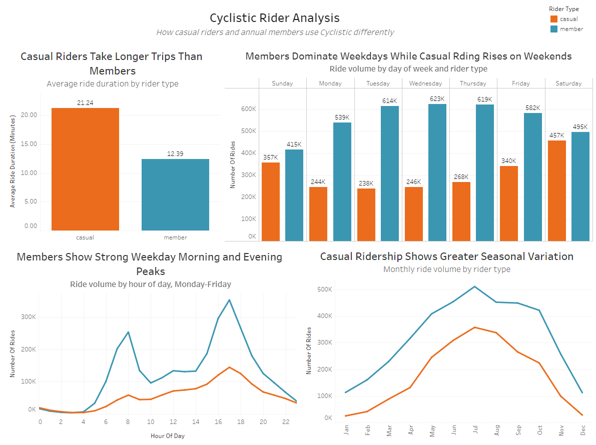

### Analyzing 6+ million bike-share trips to understand differences between casual riders and annual members

**Tools:** SQL | Google BigQuery | Google Cloud Storage | Tableau

**Dataset:** 6,037,904 cleaned bike-share trips  
**Analysis Period:** August 2025 – July 2026

---

## Project Files

- [Data Quality Checks](sql/01_data_quality_checks.sql) — SQL queries used to inspect missing values, duplicates, invalid timestamps, and ride durations.
- [Data Cleaning & Transformation](sql/02_data_cleaning.sql) — SQL used to combine, clean, transform, and verify the full-year dataset.
- [Analysis Queries](sql/03_analysis.sql) — SQL queries used to analyze rider behavior and generate the project's key findings.
- [Tableau Dashboard](https://public.tableau.com/views/CyclisticBike-ShareAnalysis_17882689134340/CyclisticRiderAnalysis?:language=ko-KR&:sid=&:redirect=auth&:display_count=n&:origin=viz_share_link) — Interactive visualization of the main findings.

---

## Project Overview

Cyclistic is a fictional bike-share company seeking to increase annual memberships. Financial analysis indicated that annual members are more profitable than casual riders, creating an opportunity for the marketing team to convert existing casual riders into members.

The objective of this analysis was to answer:

> **How do casual riders and annual members use Cyclistic bikes differently, and how can these differences inform strategies for converting casual riders into annual members?**

I analyzed 12 months of historical bike-share data using SQL in Google BigQuery and created an interactive Tableau dashboard to share the findings.

---

## Business Task

Identify differences in how casual riders and annual members use Cyclistic bikes and use these behavioral patterns to develop data-driven recommendations for converting casual riders into annual members.

---

## Data

The analysis uses 12 months of publicly available bike-share trip data from August 2025 through July 2026. The dataset is provided through Divvy, Chicago's bike-share system, and is used as the basis for the fictional Cyclistic case study. 

The data contains individual trip records, including: 
- Ride ID and bike type
- Start and end timestamps
- Start and end stations
- Geographic coordinates
- Rider type (casual or annual member)

The 12 monthly datasets originally contained **6,037,968 rides**.

Although Cyclistic is a fictional company created for this case study, the trip data is publicly available bike-share data. Personally identifiable rider information is not included, so individual riders cannot be tracked across multiple trips.

### Data Limitations

The dataset does not contain rider demographics, income, trip purpose, or information explaining why casual riders choose not to purchase annual memberships. Because riders cannot be individually identified, the analysis focuses on overall usage patterns between casual riders and annual members.

### Data Preparation & Cleaning

The original dataset consisted of 6,037,968 total trips across 12 separate monthly CSV files. Because several files were simply too large to import into a spreadsheet software, I opted to use **Google Cloud Storage** and performed the cleaning and analysis in **BigQuery**. Using SQL, I investigated missing station information, duplicate ride IDs, invalid timestamps, categorical values, and unusual ride durations. 

### Cleaning Decisions

- **Missing station data:** Identified **1,273,200 missing start-station names** and **1,336,777 missing end-station names**. Because these records represented a substantial portion of the dataset and generally retained other usable trip information, I kept them for analyses that did not require station names.

- **Duplicate rides:** Identified **35 duplicate ride records** and confirmed that they represented exact duplicate trips, deciding to retain only one copy of each ride.

- **Invalid timestamps:** Removed **29 records** where the ride ended at or before its start time (`ended_at <= started_at`).

- **Ride-duration outliers:** Investigated unusually short and long rides, including rides lasting more than 24 hours. These records were not removed solely based on duration because an unusual ride length alone was not sufficient evidence that the record was invalid.

- **Data transformation:** Combined the 12 monthly tables into a full-year dataset and created additional variables for **ride length, day of week, month, and hour of day**.

- **Data preservation:** Kept the original monthly tables unchanged and stored the cleaned dataset separately as `cyclistic_clean`.

### Cleaning Results

The final cleaned dataset contained **6,037,904 rides**. SQL verification confirmed that the cleaned dataset contained no duplicate ride IDs or rides with invalid start/end timestamps.

### SQL Example: Creating the Cleaned Dataset

The following query combines the monthly datasets, removes duplicate and invalid records, and creates variables used throughout the analysis:

```sql
CREATE OR REPLACE TABLE
  `cyclistic-capstone-506713.cyclistic.cyclistic_clean` AS

WITH combined_data AS (
    SELECT
        *,
        ROW_NUMBER() OVER (
            PARTITION BY ride_id
            ORDER BY _TABLE_SUFFIX
        ) AS row_num
    FROM
        `cyclistic-capstone-506713.cyclistic.trips_*`
),

cleaned_data AS (
    SELECT
        * EXCEPT(row_num),
        TIMESTAMP_DIFF(ended_at, started_at, SECOND) AS ride_length_seconds,
        TIMESTAMP_DIFF(ended_at, started_at, SECOND) / 60.0 AS ride_length_minutes,
        EXTRACT(DAYOFWEEK FROM started_at) AS day_of_week,
        EXTRACT(MONTH FROM started_at) AS month,
        EXTRACT(HOUR FROM started_at) AS hour_of_day
    FROM combined_data
    WHERE row_num = 1
      AND ended_at > started_at
)

SELECT *
FROM cleaned_data;
```
---

## Analysis & Key Findings

I used SQL to compare casual riders and annual members across ride duration, day of week, time of day, seasonality, and bike type. The analysis revealed four main differences in how the two rider groups use the service.

### 1. Casual Riders Take Longer Trips

Casual riders had a longer average ride duration than that of the annual members; casual riders averaged approximately **21.24** minutes when the members averaged around **12.39** minutes.

To take a better look into these findings and find out if outliers were not skewing the mean unnecessarily, the median was also found, which resulted in results that presented a **10.88** minute median ride time for casual members and a **8.52** median for annual members. 

Even though the median was considerably lower than the average for both groups, casual riders still had a higher median than the annual members, supporting the finding that they generally take longer rides.

### 2. Casual Riders Are More Weekend-Oriented

Annual members showed much heavier usage during the workweek, with Wednesday being their busiest day at **622,935 rides**. Casual ridership increased toward the weekend, with Saturday being their busiest day at **457,395 rides**.

Since members take more rides overall, the percentage of each rider group’s rides occurring on weekdays and weekends was calculated. The percentage comparison supported the pattern found in the raw ride counts as around **37.9%** of casual rides occur on weekends compared with only **23.4%** of member rides. 

This suggests that weekend rides make up a substantially larger proportion of casual rider activity than member activity.

### 3. Members Show Strong Weekday Morning and Evening Peaks

Annual members showed pronounced weekday ridership peaks around **7–8 AM** and **4–6 PM**. At 8 AM on weekdays, members recorded **253,083 rides**, compared with **58,401 casual rides**.

Casual riders also experience an afternoon peak, but their morning weekday peak is substantially smaller.

These patterns are consistent with the suggestion that many annual members incorporate Cyclistic into their regular weekday routines. However, the dataset cannot prove this hypothesis because there is no data related to the purpose of the ride for each member.

### 4. Casual Ridership Shows Greater Seasonal Variation

 Both groups displayed strong seasonal patterns as ridership increased through spring, reaching its highest levels during summer (with July being the busiest month for both groups), and declined significantly during winter.
 
The seasonal change is largely apparent among casual riders as the rides increased from only **24,740** in January to **357,769** in July.

Members also showed substantial seasonal variation, but the relative seasonal swing was greater among casual riders. Because weather data was not included in the analysis, these seasonal changes cannot be directly attributed to temperature or weather conditions.

---

## Tableau Dashboard

I created an interactive Tableau dashboard to visualize the main differences between casual riders and annual members.



[View the interactive dashboard on Tableau Public](https://public.tableau.com/views/CyclisticBike-ShareAnalysis_17882689134340/CyclisticRiderAnalysis?:language=ko-KR&:sid=&:redirect=auth&:display_count=n&:origin=viz_share_link)

---

---

## Recommendations

Based on the differences identified between casual riders and annual members, I developed three recommendations aimed at converting casual riders into annual members.

### 1. Target Casual Riders with Membership Promotions During High Casual-Use Periods

Cyclistic should advertise annual membership discounts or limited-time offers during peak casual-use periods, usually on weekends and during high-ridership summer months. Weekend rides account for **37.87%** of casual rider activity compared with **23.41%** of member activity and show strong seasonal variation with casual rides rising from about 25K in January to 358K in July.

Cyclistic could show an in-app message after a casual weekend ride that reads the following: **"Enjoying Cyclistic? Save on future rides by becoming an annual member. Join today and receive 20% off your first year.”**

### 2. Market Membership Around Repeat/Routine Transportation, Not Just Recreation

Annual members show pronounced weekday ridership peaks around **7–8 AM and 4–6 PM**, while casual riders show a much weaker morning peak.

Position annual membership as an option for routine weekday transportation by promoting membership to casual riders during peak weekday travel periods This could help position membership as useful for regular transportation rather than only occasional trips.

### 3. Use Longer Casual Rides as Conversion Opportunities

Casual riders average **21.24 minutes per ride, compared to only 12.39 minutes** for annual members. The median analysis also supported this claim.

Cyclistic could target casual riders after longer trips with personalized membership promotions. For example, the app could show how membership may benefit riders who regularly take longer or repeated trips and offer a limited-time incentive to convert.

---

## Conclusion

The analysis identified clear differences between how casual riders and annual members use Cyclistic. Casual riders generally take longer rides, account for more weekend activity, and show greater seasonal variation. Annual members, meanwhile, demonstrate more consistent weekday usage with pronounced morning and evening peaks.

These findings suggest that Cyclistic's conversion strategy should focus on reaching casual riders when and how they already use the service, particularly during weekends, summer months, and longer rides.

## Skills Demonstrated

- SQL data cleaning and transformation
- Google BigQuery
- Google Cloud Storage
- Exploratory data analysis
- Data validation and quality assessment
- Tableau data visualization
- Business-focused data analysis
- Translating analytical findings into actionable recommendations
